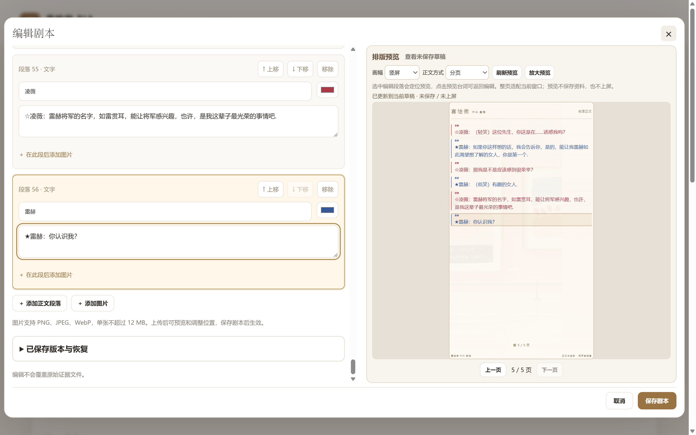

# 实施与验收记录

最新状态：2026-09-18用户初步反馈展示窗口最小化同步“似乎已经解决”，本轮更新文档并重新交付完整免安装包，见文末同日“用户试用反馈与重新交付”记录。下文各开发批次保留当时事实；早先的“仍待联调／旧ZIP未重做”不是当前状态。

## 2026-09-18 直播软件窗口采集与后台同步

用户确认使用直播软件，通过窗口采集选择 Edge／Chrome 的展示窗口。排查发现展示定位等待两次 requestAnimationFrame 和转场 finished；页面隐藏后动画帧可能停止，造成定位标志不能解除，连带阻塞分页、motion 与检查点。普通连续滚动此前也只靠动画帧推进。

本次修复：

- 布局帧等待增加限时兜底；进入后台时立即释放已经挂起的等待，跳过/取消转场。较旧的异步定位仍受版本号保护，不能覆盖新内容。
- 保留前台动画帧滚动；后台或超过500ms没有动画帧时，以低频定时器按经过时间推进。新命令重置时间基准，超过5秒未取得状态时停止外推，避免长期冻结后按旧播放状态突然补滚。
- 展示恢复可见时立即适配画面并获取最新状态，不再次调用 display/connect，不主动暂停或回滚位置；保持 motion 原有时效校验。
- 展示控制加入紧凑的展示窗口状态条、采集提示和恢复入口。提示后台、多窗口、连接/排版中、关闭或超过5秒未收到回应；恢复复用原命名窗口并请求状态，不刷新页面。状态只表示网页，不表示直播软件采集成功。

验证与边界：

- `tests/browser_background_display.cjs` 在独立8925实例通过8组检查。实际拦截并取消全部 rAF 回调，直接断言当前 document.hidden 与 visibilityState；覆盖隐藏换目录/正文、图片与精准页码、等待中途隐藏、快速连续快照、恢复无旧帧回跳、后台滚动/暂停/到末尾、可见但无动画帧时的低频推进、媒体组内分页/换组与状态条。
- 恢复按钮在暂停媒体及正在滚动两种情况下都未新增 display/connect，未重置播放、媒体时间或当前页。1440px/390px无横向溢出，截图已目视检查。
- 既有 `browser_feedback.cjs`、`browser_directory_sync.cjs`、`browser_media_sync.cjs` 通过；目录同步最大逻辑误差1px、手动0px，浏览器错误为0。目录测试补充显式选择连续滚动并展开即时控制，以匹配现行默认分页及折叠界面，保留原同步和悬停断言。
- JS语法与差异格式检查通过。本次只修改前端、测试与说明，没有改后端或迁移资料。日常8765验收时未运行且没有服务记录，因此未为验收启动、重连或写入日常资料；不将此前的正式只读记录算作本次结果。下次正常启动后刷新展示控制与展示页即可加载；展示页刷新仍按既有规则暂停恢复。

证据：`.qa/browser/background-display-result.json`、`background-display-health-1440.png`、`background-display-health-390.png`，以及 `feedback-result.json`、`directory-sync-result.json`、`media-sync-result.json`。

这些测试验证浏览器中的状态、DOM和操作，不等于 Windows 真正最小化后的绘制、直播软件实际采集帧或声音联调。浏览器可能节流或冻结后台，网页无法保证最小化窗口持续产生可采集的新画面。实播保持展示窗口未最小化；遮挡仍停帧时并排或放到第二屏保持可见。参见[使用说明](使用说明.md#在直播软件中选择展示窗口)。

## 2026-09-18 手动添加正文图片

按用户要求补齐正文图片编辑：可从本机上传 PNG/JPEG/WebP，追加至末尾或插入指定段落后；支持大图预览、替换、移除，以及文字和图片上下排序。单张不超过12 MB，图片先真实解码校验，手机照片按 EXIF 转正后清除元数据。

上传先保存为本地资源，仅在点击“保存条目”后改变正文。取消编辑不改原条目；替换和排序保留段落ID及来源，媒体时间点仍按稳定ID引用；已上屏快照保持不变。上传期间禁止保存，关闭或切换条目后忽略旧会话的迟到响应。图片不自动进入分组背景库；保存后的图片及历史仍引用的旧图随完整备份保存。

验证结果：

- Python **102/102通过**，包括新增11项正文图片测试；覆盖三格式、非法/过大/动态图拒绝、EXIF转正、上传草稿隔离、重复图、文件写入失败、快照/历史/时间点与备份恢复。
- `tests/browser_script_images.cjs` **8组通过**：真实文件选择上传、插入和排序、替换稳定ID、大图预览、非法图片保留草稿、明确保存/取消、跨会话迟到响应、阅读/分页及390px布局。截图经目视检查。
- `tests/browser_import_editor.cjs` **通过**：既有粘贴/TXT/DOCX预览、空行处理、角色候选、原插图保留和窄屏无回退。
- 正式更新前完成资料ZIP备份，随后重启8765；正文、分组、历史、保存设置和媒体资料逐项不变，仅按既有启动规则增加播放修订号并保持暂停。正式页面提供添加按钮与上传路由，没有向日常资料上传测试图片。

正式页面只读验收通过：新建草稿的添加图片按钮可用，原7张图片完整显示，替换/移动/段后插入控件正常；写请求为0，资料与完整展示状态前后逐项一致（revision782→782）。证据：`.qa/browser/formal-script-images-result.json`。

浏览器证据：`.qa/browser/script-images-result.json` 和对应截图；正式更新证据：`.qa/formal-script-images-update.json`。备份：`instance/backups/before-script-images-20260918-093719.zip`，SHA-256 `122668da9f5e9b8f2352fda65ccae8f8ef13c2d49a18bd90799570cce7dd53df`。更新时 revision 781→782；这是本次验收时状态，不覆盖后续用户操作。

## 2026-09-18 音视频配本与展示控制布局更新

本轮按用户后续授权落实本地音视频配本：手工标记时间并选择台词，到点自动暂停、读完手动继续；并完成展示控制两栏高度与窄屏整理。早期“视频仅预留”的记录保留其历史含义，现行范围见[项目计划书 v0.6](项目计划书.md)及[音视频配本说明](音视频配本.md)。

### 界面和操作

- 桌面宽度大于1040px时，左侧“准备展示内容”与“调整展示画面”合计不超过右侧预览；设置中部独立滚动，短屏卡片不超过视口减48px。1040px及以下按准备→预览→设置排列，设置自然展开。320/390/768/1040/1041/1200/1440px宽度无横向溢出。
- 移除独立的“当前展示 · 即时展示控制”大模块，合并到预览下方；“暂停展示”常显，开始/速度/定位/翻页收进“展示控制”。这些操作仍只控制已上屏内容。
- 每篇可关联一份本地视频或音频；有关联时才可选音视频正文。新增专门配本页面，从阅读、内容管理和展示控制准备区进入。
- 手工标记当前时间，或填入分秒/秒数，多选原文字和插图；保存才入库。重复时间、负数、超时长及无台词的时间点拒绝；允许清空全部时间点。替换文件清空旧点，解除关联不删历史资源。
- 自动台词随暂停点定位；手动台词保持操作者选择，到点仍暂停。支持播放/读完继续、暂停、拖动进度、前后台词；回退后可再次触发后续点。原图保留，不自行OCR或改写台词。
- 竖屏媒体上、台词下；横屏左右分区且可交换。切换画幅保留媒体模式和媒体位置，排版按各方向设置。
- 确认模式仅准备，应用后暂停；实时同步携带媒体位置/台词/消费过的时间点。预览默认静音，实时绑定锁定静音，观众窗口播放声音；浏览器拒播时明确提示并暂停。

### 测试和修复

| 检查 | 实际结果 |
|---|---|
| Python全套 | **83/83通过**：53既有后端、10解析、1启动、19媒体。含42MiB真实WAV跨越旧40MB限制备份恢复、伪装/篡改容器、cue合法性、快照和历史保留、上传/事务失败清理与旧数据兼容 |
| `browser_media_editor.cjs` | **通过**：真实WAV/WebM上传，文字/图片多选、标记/修改/删除/保存、取消与错误保留草稿、390px布局、保存前不写cue、live不变 |
| `browser_media_player.cjs` | **13组通过**：浅色台词对比度与原文/源色不变、真实媒体、0秒点、继续/回退/前跳、手动台词、漂移阈值、跟随过期、声音锁定、拒播/坏文件、销毁、横竖及手机 |
| `browser_media_sync.cjs` | **通过**：真实《爱情公寓》MP4解码与Range定位；WAV到点暂停；确认隔离、观众自主暂停持久化、实时同步与单路声音、手动台词、横竖交换、无媒体回普通正文、刷新暂停 |
| 同步恢复补验 | **通过**：即时暂停不回旧checkpoint；无观众窗口时后台返回使用播放器真实当前位置，避免恢复旧隐藏时刻重走cue |
| `browser_control_columns.cjs`、`browser_settings_panel.cjs` | **通过**：两栏高度、短屏552px卡片、内部滚动和键盘可达、保存入口、外置工具、窄屏堆叠与草稿隔离 |
| 既有流程回归 | `browser_directory_home.cjs`、`browser_feedback.cjs`、`browser_pagination.cjs` **通过**；分页包括横竖、字号及高达648页的边界排版 |

本轮修复了横竖切换退回滚动模式、媒体暂停使用旧位置，以及无观众时后台恢复旧媒体位置三个联调问题。测试中的时间点只在隔离资料中创建，不写入日常条目。浏览器为本机Edge；实际直播画面/声音采集尚未验证。

截图和结果位于 `.qa/browser/`：`media-editor-result.json`、`media-player-result.json`、`media-sync-result.json`、`control-columns-result.json`、`settings-panel-result.json`，以及对应横竖屏/手机截图。相关截图已目视复核。

### 正式更新和来源保护

- 更新前备份：`instance/backups/before-media-cues-20260918-004529.zip`，SHA-256 `a919a311fb7922832893aa4f0aba4ff551a371a28d71e871698601d9eb66bde9`，ZIP完整性通过。
- 正式服务已重启（本次启动PID98252，地址仍为127.0.0.1:8765）。启动后核对meta、7条分组、14篇条目、原1条历史、队列/排版/背景/方案与更新前一致。旧快照仅补媒体默认排版字段；备份之后展示位置与revision已有变化，保留现状，未用备份覆盖用户后续操作。
- 经授权关联《爱情公寓》样片到 `script-08`，原正文和来源字段、其他13篇条目与分组未变。新增媒体及其修改历史，导入期间live状态逐项一致；正式cue为空，等待用户实际标记。
- 样片：60,672,990字节，210.977007秒，1280×592；项目副本在 `instance/media/0880f1a624369891671b84595b3291f01f4afef67a7afc67f5c85c18ec827cb1.mp4`，与用户桌面原件SHA-256相同。来源记录见[样片证据](../evidence/media-experiments/爱情公寓-20260918.json)。
- 两份原演示文稿重新校验，哈希仍与原清单一致。新增视频后的ZIP导出73,815,551字节，完整性及内含样片哈希通过；没有替换原证据。
- 正式数据核对记录：`.qa/formal-media-update.json`。正式页面只读验收 `.qa/browser/formal-media-result.json` **通过**：普通展示控制首次进入分组总览；真实样片在确认预览定位10秒、切横竖/左右及390px排布正常；仅6次 `/api/preview` 请求，其他写请求尝试为0，页面异常为0，14篇正文和媒体资料一致、cue仍为空，revision381→381。正式横竖及手机截图已目视复核。

本轮不生成视频、不转码、不识别音轨或自动对齐时间点；跨设备/多人、AI服务及真实直播客户端接入仍需后续明确需求。

首次交付：2026-09-17；最新更新：2026-09-18  
版本：0.1.0，本地单体网页。用户已明确授权正式启动；随后选择先完成本地网页，直播客户端待确定后联调。

## 最新增量：设置高度、导入空行与目录入口（2026-09-18）

按最新使用反馈完成三项改动，并备份重启正式服务：

- 桌面“调整展示画面”最高640px，短屏按窗口高度缩减；标题/画幅方向和保存区保持在卡片内可见，中部独立滚动并可键盘聚焦。800px及以下自然展开，避免手机嵌套滚动。所有既有设置ID和保存规则保留。
- 粘贴、TXT、DOCX共用解析路径，跳过纯空行及仅含空格、制表符、全角空格的行，不计为段落。完整原文仍在对照区，非空行字符与行尾不改；不清理既有资料或用户手动添加的空块。
- 准备模块“条目目录”按钮直达分组总览，保留所选分组或本场范围，包括空本场；预览工具栏返回仍逐层进行。确认模式不改live，实时模式同步到总览。

| 验证 | 结果与证据 |
|---|---|
| Python全套 | **64/64通过**：53项后端、10项导入解析、1项启动器 |
| `tests/browser_settings_panel.cjs` | **通过**：1440×900卡片640px、1440×600卡片552px，内部滚动、控件焦点、方案保存及固定保存入口；390px自然展开，外置预览工具可达、无横溢出。`settings-panel-result.json`及4张`settings-panel-*.png`已视觉检查 |
| `tests/browser_directory_home.cjs` | **通过**：正文直达链接返回主目录、预览逐级返回、分组/queue范围保留、空queue、确认不打断播放、实时分页正文回总览。`directory-home-result.json` |
| `tests/browser_import_editor.cjs` | **通过**：粘贴/TXT/DOCX各跳过3条空白行，分别保留6/3/5段；源文对照和已有块保留，完整保存/取消/图片/角色流程回归。`import-editor-result.json` |
| `tests/browser_presets_entry.cjs` | **回归通过**：新滚动区内方案操作、默认/自定义载入、保存边界及首次入口仍正常。`presets-entry-result.json` |
| 正式只读检查 | **通过**：卡片640px、正文切目录直接六类总览、空行示例仅生成两段；浏览器无异常、无业务写请求，live revision检查前后均314。`.qa/browser/formal-control-refinements-result.json` |

写入验收使用独立`.qa/`数据目录。正式更新前ZIP为 `instance/backups/before-control-refinements-20260918-000108.zip`，完整性通过；原有meta、7个分组记录、14篇条目、1条历史、队列、背景、两方向排版和方案逐项与备份一致。重启按既有规则暂停恢复，快照ID和已保存页位置保留；此后的用户操作继续保留。对比见 `.qa/formal-control-refinements-update.json`。

本轮同步使用说明、项目上下文和计划现行行为。下文2026-09-17结果为之前功能交付证据，不冒充本轮全部重跑。

## 2026-09-17功能交付结论

首版本地网页已实现，交付地址为 `http://127.0.0.1:8765/`。首版交付时正式资料库为 14 篇原始收录内容、6 个初始分组及系统“未分组”；本场队列为空，尚未应用展示，未混入测试数据。只监听本机回环地址。

首版后已完成资料页简化、预览直接交互、短转场、操作栏位置与反馈模式、两层目录、背景素材管理及连续同步，前轮分组排列也已正式更新。本轮进一步统一普通展示控制入口，增加悬停反馈、正文分页、默认加10套展示方案、文本/TXT/DOCX识别导入与同本角色复用。最近功能交付的 Python 自动化测试63/63通过，导入、方案与入口、反馈模式、目录同步、直播恢复、分组排列、分页及原交互浏览器验收均已通过，分页截图已完成视觉检查。本轮正式资料已备份，服务已重启，更新后的正式只读检查通过；详细证据见本轮增量记录。

日常入口：[启动工作台.cmd](../启动工作台.cmd)、[停止工作台.cmd](../停止工作台.cmd)、[使用说明](使用说明.md)。

## 实现范围

| 方面 | 本次实现 |
|---|---|
| 初始内容 | 14 篇、69 页、516 个文字块和 7 个正文图片块；段落 ID、来源页、角色颜色、提示和原文疑点保留 |
| 内容管理 | 分组、搜索、原备注筛选、正文阅读、字号/行距、本场列表与排序；资料页隐藏 PPT 页码与页码导航，源页映射仍内部保留 |
| 分组与资料 | 分组增删改查、排序、主题与显示状态；含本删除先转移；条目新增、编辑、隐藏及修改历史；粘贴/TXT/DOCX识别预览导入和同本角色复用 |
| 展示 | 独立观众窗口，分组/列表/正文，横竖两套画布与配置，滚动或自动分页手动翻页，语义定位与实时悬停反馈 |
| 状态 | 默认确认模式下预览不改当前画面；Apply 冻结内容并可携带预览选段原子上屏；即时命令独立；滚动段落/分页页码检查点；展示刷新和服务重启后暂停恢复 |
| 一致性 | 草稿变化时暂不能应用；预览 token 拒绝未经重新预览的资料变化；普通轮询不回拉位置 |
| 预览交互 | 鼠标悬停浮动工具或外置操作栏；目录卡片进入正文/返回目录；选段、前后段、顶部、试滚、字号和浮动应用；确认模式需点击应用，另可选择实时同步 |
| 转场 | 预览与展示窗口目录/正文切换约 270 ms；内容管理页与正文往返短转场；遵循减少动态效果设置 |
| 数据 | SQLite事务、来源字段保留、默认及最多10套横竖展示方案、完整ZIP备份、恢复前自动备份、图片跨目录恢复与校验 |
| 启动 | 项目自带 Python 3.14.7、锁定依赖；中文/空格路径、端口占用、单实例锁、安全停止 |

原始 PPT 与需求截图没有改动。种子数据可重建，但不会覆盖用户已经编辑的数据库；提取与核对详见[内容导入核对](内容导入核对.md)。图片中文字保留原图，没有擅自 OCR 后声称完整转写。

## 最近功能交付验证

以下为2026-09-17功能更新时的实测结果，本次文档整理未重新执行。

### 普通入口、悬停、分页、方案与导入（最近功能交付）

**入口问题的正式只读复现。** 证据 `.qa/browser/first-entry-diagnosis.json` 显示，原已上屏状态为 `mode=list`、`directory_level=scripts`、`focus_category_id=cat-sweet`。旧实现首次进入只有0个分组卡片、3个条目卡片，操作后才出现6个分组卡片、0个条目卡片；检查前后 live revision 均为195。这解释了上一轮只兼容旧平铺列表仍不足：它继续从现代已聚焦快照恢复二级目录。

本轮现行行为：

1. 普通 `/control` 入口及刷新一律准备分组总览，无需先操作。无论 live 保存的是旧平铺列表、所属分组或正文，都不复用其导航层级；只有 `/control?script=<id>` 明确直接打开正文。进入/刷新不写 live，记住实时模式也不会发布初始草稿或暂停当前展示。
2. 单列分组悬停采用1.04倍轻微放大与加深背景；分组、条目卡片和正文的悬停反馈在有效实时绑定下同步。确认模式仅在预览显示临时反馈，解绑或断流后观众临时焦点消失。
3. `body_mode=scroll|pages` 提供连续滚动与自动分页。分页按实际画幅、字号、行距、留白和内容计算，长段可以跨页，使用人工上一页/下一页；页与源段落位置一起用于预览应用及同步。分页专项浏览器验收已通过5组全文、颜色、图片数量与页高检查，并验证当前页应用及翻页同步，横竖分页与重排截图已完成视觉检查。
4. 系统默认设置与最多10套自定义展示方案各自保存。每套包含横竖完整排版，支持另存、覆盖、改名和删除；覆盖、删除需确认。保存方案不改 live 或当前保存的 layout，选择方案本身不载入，载入遵循确认/实时反馈；载入真默认保留其他已存方案。
5. 导入支持粘贴、TXT和DOCX，本地规则识别标题、作者、角色，保留原文及换行供对照。识别和填入都只是草稿，正常保存条目才入库；取消及识别错误不改草稿。默认追加保留旧块ID/来源；替换仅替换文字，原插图及其ID/来源按原序保留在新文字末尾。DOCX提取段落及表格文字，不新增其中的图片。
6. 角色标签提供本条目已有角色的下拉候选，允许自由输入新角色并即时复用；不改写正文中的角色前缀。

当前验证状态：

| 检查 | 本轮状态与证据 |
|---|---|
| Python自动化测试 | **63/63通过**：53项后端、9项导入解析、1项真实进程启动 |
| `tests/browser_import_editor.cjs` | **通过**；8896独立资料：粘贴/TXT/DOCX原文拼接保真，预览取消、在途取消、草稿/保存边界，角色复用，TXT安全显示，DOCX段落/制表/软换行/表格，追加旧块保真与替换保留原图，文件错误和手机布局。结果 `import-editor-result.json`，截图 `import-editor-mobile.png` |
| `tests/browser_presets_entry.cjs` | **通过**；8897独立资料：三类已上屏状态从首页进入/刷新都直接总览且不写live，`?script`正文入口，记住实时模式隔离，10套上限及重名反馈，取消/确认覆盖、改名、删除，横竖设置，确认/实时载入边界、真默认与刷新保存。结果 `presets-entry-result.json`，截图 `presets-controls-desktop.png`、`presets-controls-mobile.png` |
| `tests/browser_feedback.cjs`、`tests/browser_directory_sync.cjs`、`tests/browser_live.cjs` | **本轮回归通过**，结果分别为 `feedback-result.json`、`directory-sync-result.json`、`live-result.json` |
| 分页专项浏览器验收 | **通过**；5组全文、角色颜色、图片和页高检查，确认模式精确页码应用、实时翻页、即时展示控制翻页、分组/条目/正文三种悬停与隐藏恢复均通过；结果 `pagination-result.json`，截图 `pagination-portrait.png`、`pagination-landscape.png`、`pagination-reflow.png` 已视觉复查 |
| `tests/browser_interactive.cjs`、`tests/browser_category_layout.cjs` | **本轮回归通过**；原交互验收发现新增设置使预览浮栏超出视口，已将 `.preview-panel` 的 `align-self:stretch` 改为 `start` 后验证通过；结果 `interactive-result.json`、`category-layout-result.json` |
| 本轮正式备份、服务重启与正式只读检查 | **通过**；`.qa/formal-pages-import-update.json` 与 `.qa/browser/first-entry-after.json` |

正式更新前备份为 `instance/backups/before-pages-import-20260917-233142.zip`，ZIP完整性检查通过。重启后与备份数据库逐表比较：meta、7个分组记录（含系统未分组）、14篇条目、1条历史记录、队列、背景原记录和原有排版全部一致；新版仅增加空的 `layout_presets` 列表。展示快照ID保留；重启按原有暂停恢复规则使revision从195增至196。

正式只读浏览器验证：旧live仍保存甜本二级目录，但从首页初次进入和刷新展示控制页均直接出现6个分组、0个条目卡片；无需操作“准备展示内容”。同时核对两种正文模式、默认方案及导入窗口正常加载。整个检查revision保持196，资料写请求为0，浏览器异常及HTTP错误为0。修复前后证据为 `first-entry-diagnosis.json`、`first-entry-after.json`，截图为 `first-entry-before.png`、`first-entry-after.png`。

上述结果和截图位于 `.qa/browser/`。导入与方案写入验收各用独立8896/8897实例及按时间建立的 `.qa/` 资料目录，结束后已停止，不向正式8765资料写入测试内容。原始PPT和现有来源记录未作迁移或改写。

## 历史增量记录

以下保留各阶段的测试数量和当时行为，其中“本轮”均指相应历史阶段；现行规则以前文最近交付及使用说明为准。同名 `.qa/browser/` 结果可能被后续回归覆盖，历史统计不可当作当前一次测试的统计。

### 早期交互版本后端和启动器

本轮使用项目自己的 `runtime/python.exe` 运行 `test_backend.py`，**20/20 后端集成测试通过**。覆盖来源保真、编辑历史、预览冻结、旧预览拒绝、分组转移、隐藏/删除后的上屏快照、空队列、顶部及段落恢复、横竖配置、旧检查点拒绝、跨目录备份恢复、损坏/越界 ZIP 与异常数据库拒绝、本机请求保护。

本轮新增 3 项验证：有效 preview_anchor 随候选内容和布局原子应用并暂停；定位属于旧直播而不属于候选内容时，409 拒绝且 live/layout 全部保持；省略预览定位时保留原规则，显式 null 仍表示顶部。验证同时确认纯预览不会更新直播或保存候选布局。

本轮进一步执行全套回归，20 项后端测试和 1 项真实进程启动测试全部通过，合计 21/21。

启动测试使用中文和空格目录，实际启动 Waitress；验证端口被占用时换端口、不同端口再次启动仍复用同一资料实例且不重置播放、复制资料目录的停止命令不关闭原实例、正常停止完整退出。

本轮后端命令：`runtime\python.exe -m unittest discover -s tests -p test_backend.py -v`。全套回归命令为 `runtime\python.exe -X utf8 -m unittest discover -s tests -p "test_*.py" -v`。

### 首版基线浏览器验证

使用本机 Microsoft Edge 的独立无头测试配置，不使用个人浏览器资料。此前四组浏览器验收脚本通过：

| 脚本 | 通过的操作 |
|---|---|
| `tests/browser_management.cjs` | 新增分组、重名提示、新增/编辑正文、文字安全显示、取消删除、删除分组后迁移、隐藏、ZIP 下载和恢复 |
| `tests/browser_layouts.cjs` | 0/1/6/12/30 个分组、长名称、390px 手机及 1440px 电脑宽度；分组均可到达，无整页意外横向溢出 |
| `tests/browser_smoke.cjs` | 搜索、7 张正文图片、本场队列、展示控制、竖屏/横屏、自动滚动、操作页刷新不断播、展示刷新暂停 |
| `tests/browser_live.cjs` | 命名展示窗口复用、暂停不回弹、草稿方向不改直播、服务重启后状态与 CSRF 恢复、继续保存检查点 |

页面运行没有 JavaScript 异常；已视觉查看内容管理、正文、展示控制预览、竖屏及横屏截图。测试期间阻断非本机资源请求，工作台仍正常运行且未发起外部页面资源请求。未更改用户电脑的网络设置。

上述首版写入验收使用 `.qa/` 或临时目录内的独立数据库，结束时测试服务已停止。后续验收继续使用独立测试资料；测试脚本有意修改资料，不应针对日常资料目录运行。

### 预览交互改进浏览器验收

状态：**通过**。`tests/browser_interactive.cjs` 在 `.qa/interactive-preview` 独立数据库及 8879 端口验证：

- 预览目录卡片进入正文和返回目录，保留本场列表；鼠标悬停工具、选段、上一段/下一段、顶部、字号调整与本地试滚。
- 正在直播时上述准备操作不改变直播快照、版本和播放状态；预览 iframe 不发送任何写请求。
- 浮动与外部两个应用按钮都携带当前选段；末段受滚动边界限制时仍保留选定 ID，应用后暂停。
- 预览与展示窗口目录/正文短转场、普通内容管理/正文往返及浏览器返回、减少动态效果设置；观众窗口没有预览工具。
- 逐一检查 14 篇阅读页及展开备注无来源页码；编辑标题但不改备注时，原始备注、源页与全部正文块保持一致。
- 横屏、竖屏及 390px 窄屏布局；新增工具栏底部可见范围断言。截图复查修复了原 iframe 最小高度大于容器导致的工具栏裁切。

同时重新执行 `tests/browser_live.cjs`，展示窗口复用、暂停不回弹、草稿隔离、服务重启与 CSRF 恢复继续通过，页面无 JavaScript 异常和外部资源请求。

本轮结果及截图位于 `.qa/browser/interactive-result.json`、`live-result.json`、`interactive-control.png`、`interactive-landscape.png` 和 `interactive-mobile.png`。正式资料在更新前保存 ZIP 备份，并在重启前后核对条目、分组、队列、布局的内容指纹；没有向正式资料导入测试数据。

### 操作栏位置与反馈模式增量验收

新增独立设置“操作栏位置”和“操作反馈”，默认画面内移入显示、逐步应用。画面外时工具位于预览下方，与应用按钮同行，窄屏自动换行。两项设置保存在当前浏览器；刷新展示控制页恢复设置但不自动发布初始草稿。

实时模式同步切换、返回、定位、滚轮停下后的段落位置、排版、播放/暂停。选择实时模式会先向 iframe 获取当前位置和播放状态，所以确认模式试滚后切换不会从旧起点上屏。切回确认模式丢弃尚未发送的自动任务；已发送请求可能已经生效，后续操作不自动发布。错误停止自动同步并显示手动重试入口。

- 后端 25 项及真实进程启动器 1 项，合计 **26/26** 通过。新增覆盖严格布尔参数/有效预览要求、同内容复用快照、内容/排版变化、陈旧令牌和非法定位的原子拒绝、空内容不可开始播放、默认确认仍暂停。
- `tests/browser_feedback.cjs` 通过：四种设置组合、桌面同行/390px 无溢出、实时内容管理/返回/选段/滚轮/字号/方向/播放暂停、保留同内容快照、确认隔离、设置持久、刷新不发布/不停播、陈旧内容不自动重试。
- 专门延迟第一次应用验证最后一次选段最终生效；延迟旧模式失败后切确认再切实时，验证新的同步任务不被旧失败清除；试滚越过数段后切实时，验证取得即时位置。
- `tests/browser_interactive.cjs` 与 `tests/browser_live.cjs` 重新通过，原确认操作、转场、资料页简化、来源保真和启动恢复行为保持。
- 视觉检查外置操作栏电脑与窄屏截图，按钮可达且按宽度换行。浏览器没有 JavaScript 异常。

本次使用新建 `.qa/feedback-*` 资料目录，测试未写正式库。结果保存于 `.qa/browser/feedback-result.json`，截图 `feedback-outside-desktop.png` / `feedback-outside-mobile.png`。更新正式服务前另存资料 ZIP，并以条目、分组、队列及布局内容指纹核对重启前后不变。

### 两层目录、背景图管理与连续同步增量验收

目录改为分组总览 → 所属分组的全部可见条目 → 正文；总览沿用原 PPT 主题背景，最多展示三条示例剧名。二级目录包含简介、作者、备注和标签。本场模式只展示本场范围；普通空分组仍可进入，空系统“未分组”隐藏。旧 API 和旧备份保留平铺目录兼容，不把导航层级误作父子分组数据。

内容管理增加背景素材库：上传、预览、改名、删除；分组编辑可选择、更换、清除或直接上传背景。上传校验真实图片后保存；内置原件和被分组、正文、展示快照或历史引用的图片受保护。备份包含未引用的自定义背景及名称信息。图片写入或关闭失败会清理本次半截文件、保留原库及此前同名完整文件，允许重试。

外置按钮使用 15px 字号和至少 44px 高度，与应用按钮在同一操作区，窄屏换行。实时模式使用同一浏览器内的窗口通信连续发送实际滚动位置，内容更新成功后才绑定预览与展示；确认模式、未应用的新草稿或同步错误解除绑定。持久化仍保存语义位置，不逐帧写数据库。后台返回先取得观众实际位置，避免旧预览把画面拉回；无回复时短超时后按时间估算。

- 后端 40 项及真实进程启动器 1 项，合计 **41/41** 通过，覆盖两层目录/空分组/本场范围/旧备份、背景校验/引用/备份恢复及写盘异常。
- `tests/browser_directory_sync.cjs`：分组总览、完整二级列表、关键要素、阅读返回、逐层返回、空类、横竖屏、桌面与390px按钮、确认隔离通过。真实双窗的18组自动滚动采样最大偏差1个逻辑像素，手动滚动最大偏差0；未出现逐帧应用请求。此为本机测试结果，不作为所有设备的延迟保证。
- 该测试也通过浏览器内模拟 visibilitychange 验证：预览隐藏时停止驱动，观众继续；返回后查询实际像素位置并续播。此检查不是操作系统最小化/休眠或真实直播采集验证。
- `tests/browser_backgrounds.cjs`：无效文件拒绝、上传、改名、选用/清除、引用及内置删除保护、编辑内上传后取消不改分组、未引用删除、ZIP备份恢复图片和元数据、手机布局通过。
- 两层导航适配后的 `tests/browser_interactive.cjs` 与 `tests/browser_feedback.cjs` 通过；保留确认隔离、来源保真、异步最后操作生效、旧反馈模式错误隔离及陈旧预览自动停止等原断言。
- `tests/browser_live.cjs` 通过：命名窗口复用、暂停位置保持、草稿隔离、服务重启、CSRF恢复和仅本地资源；页面无 JavaScript 异常。

写入测试只使用 `.qa/` 下按时间新建的独立资料目录，测试服务均在结束时停止。证据在 `.qa/browser/`：`directory-sync-result.json`、`background-result.json`、`feedback-result.json`、`interactive-result.json`、`live-result.json` 及对应截图。已视觉复查分组总览、背景素材库和窄屏操作栏。

本轮曾出现一次移动端浮栏“回顶部”测试等待超时；完整复跑通过，再按同一流程连续执行25轮“回顶部/下一段”也通过，未发现确定的产品故障。记录此测试现象，不将重复成功表述为已经定位并修复该偶发原因。

正式更新前备份：`instance/backups/before-directory-update-20260917-223205.zip`。更新后正式资料为14篇、6个初始分组加系统未分组，新增6张内置背景素材记录；条目、分组、队列、布局的内容指纹前后一致。结果见 `.qa/formal-directory-update-result.json`。正式服务已重启；随后仅只读浏览目录、控制台和背景库，未发出应用或资料写请求，直播版本不变，见 `.qa/browser/formal-readonly-result.json`。

连续像素同步要求展示控制页和展示窗口在同一浏览器、同一站点会话中打开，推荐使用“打开展示窗口”按钮。不同浏览器或未来其他设备当前仅有 HTTP 状态同步兜底；实时跨设备画面同步留待局域网阶段。程序恢复仍以保存的段落为准。

### 首次进入、分组排列与悬停摘要增量验收（上一轮历史）

上一轮修复展示控制初始化将旧平铺目录作为新版预览的问题，当时仅旧平铺列表首次进入直接生成分组总览，并保留现代已聚焦分组或正文。**该入口规则已被下述本轮统一规则修正，不再作为当前行为。** 转换只在草稿发生、不自动发布的边界继续保留；初始化仍以最新保存的横竖排版为准，避免旧展示快照覆盖新保存设置。

新增分组排列自动/1/2/3/4列、分组背景浓度0–100%（默认80%），横竖分别保存。取消分组图上过厚的白遮罩，让背景浓度实际可见；文字局部浅底保留可读性。单列显示左侧分组条，鼠标悬停或键盘聚焦后在右侧显示最多3篇条目的标题、简介、作者及原配音信息，仍通过点击进入完整目录。摘要位于独立舞台层并限制在可视区，实时模式同步、确认模式隔离；断流后临时提示隐藏。摘要打开时内置浮栏暂时收起，避免遮住内容，键盘聚焦浮栏仍可用。

- 后端45项和启动器1项，**46/46通过**；新增配置边界、横竖独立、令牌和快照、旧资料只读补默认、备份恢复校验。
- 当时的 `tests/browser_category_layout.cjs` 完整通过：初次旧列表迁移不写live、按当时规则保留现代导航（此项已由本轮普通入口统一规则替代）、0–4列、浓度两端与中值、确认隔离、实时排版、保存后重进、双窗悬停同步、最多3篇/空分组/键盘、移动可见及边界、浮栏不遮挡。结果 `.qa/browser/category-layout-result.json`，6张截图 `category-layout-*.png`。
- `tests/browser_directory_sync.cjs`、`tests/browser_feedback.cjs`重新通过；实际双窗滚动本轮最大采样差2个逻辑像素，未发现页面JavaScript异常。
- 视觉复查横竖多列与单列摘要。曾因截图自动滚动导致鼠标离开分组而误报观众同步失败；测试调整为先确认悬停同步再截图。另加强移动断言，先确保摘要可见再检查边界，防止隐藏元素零尺寸误通过。

正式更新前备份：`instance/backups/before-category-layout-20260917-225449.zip`。服务已重启并通过正式只读页面检查。以备份数据库逐表比对：条目、分组、历史、队列、背景素材原记录一致，原有排版字段一致；更新后已有新列数和展示操作，保留最新值，不用旧状态覆盖。验证见 `.qa/formal-category-layout-result.json` 与 `.qa/formal-category-layout-db-comparison.json`。测试写入均在独立 `.qa/` 实例。

## 独立运行基础

Python 官方便携包 SHA-256 与官方发布记录一致，全部依赖保留离线 wheel 并固定版本。实际 `sys.executable` 和 `sys.path` 均指向本项目，隔离模式为 1，没有代理工具私有包路径；实际进程启动测试以其他工作目录运行通过。

程序独立运行无需调用 Codex。没有通过关闭 Codex 本身进行人工双击验收；自动化实际启动、停止和窗口流程已验证。运行环境说明及官方来源见[运行环境](运行环境.md)。

## 本次保留的边界

- 直播客户端尚未确定，没有进行实际开播、窗口采集或网页来源联调。网页本身不直接推流。
- 初始条目范围是 PPT 已收录内容；原稿错序、人名及角色配置疑点保留，未替用户修订。
- 视频生成/播放、上视频下台词、多人控制、局域网与公网开放仍为后续升级。
- 当前按一个观众展示窗口使用；滚动恢复以保存段落为准，分页恢复以保存页码为准。字体和排版变化会重新计算分页，不承诺意外关闭后的滚动像素精确位置。
- 字体使用 Windows 本地字体。换电脑复制完整项目后，应再核对字体效果和实际直播采集尺寸。

## 持续维护

实际数据在 `instance/workbench.sqlite3`，恢复前备份在 `instance/backups/`。原件证据在 `evidence/`。源码、模板、初始数据与来源记录可进入版本管理；运行时、wheel 缓存、用户数据库和 `.qa/` 不进入 Git。本次未执行 Git 提交或推送。

后续先阅读 [PROJECT_CONTEXT.md](../PROJECT_CONTEXT.md)，再按使用反馈调整；不把未来视频预留自动扩入当前版本。

## 文档整理记录（2026-09-17）

按用户要求统一现行文件：计划整合为v0.5，README和使用说明补齐当前操作，项目上下文去除重复的增量附记，本记录将最近验收前置、历史结果分区，新增维护与文件索引。同步标注开工审查的历史身份、来源派生报告的生成方式，以及已实现纯正文翻页与未来视频功能的边界。

本次仅核查代码与已有验收证据，检查文档链接、版本引用和现行规则；未运行功能写入测试，未重启服务，未修改数据库、程序、种子或原件。文件职责与后续更新方法见[维护与文件索引](维护与文件索引.md)。

## 2026-09-18：默认分页、清晰预览与方向键（已正式更新）

普通正文的系统默认设置改为分页（横屏与竖屏均为 `pages`），连续滚动仍可选择。明确保存的滚动/媒体设置及自定义方案不批量改写；旧上屏快照与备份未带 `body_mode` 时继续按旧 `scroll` 恢复，不改变其内容和位置。无媒体条目从媒体方式回退为分页。

预览的竖屏常规画面由约280px宽增加至460px，“放大预览”最大640px，横屏按当前可用宽度。窄屏按宽度收窄、矮屏自然纵向滚动；桌面左侧两模块高度仍不超过右侧预览。放大收起准备/设置区，粘性标题保留恢复入口，按钮或 Esc 退出，复用原 iframe，不生成新快照、不触发应用。退出恢复原工作台页面滚动位置。

预览获焦点后，←/↑ 与 →/↓ 对应上一/下一页、段或台词组；目录左右顺序、上下按网格移焦，Enter 沿用打开操作。保护输入框、下拉、滑块、编辑区域、IME、修饰键、禁用目标；长按不连续跳跃；首尾边界消费默认滚动但不发送无效定位。父页桥接校验同源、iframe source 和 snapshot_id。使用既有命令通道，确认/实时语义不变。

验证结果：

- Python **87/87**（57 backend、10 parser、1 launcher、19 media）通过。
- 新增 `browser_preview_keyboard.cjs`（8905）：三正文模式四方向、两层目录与 Enter、父消息来源/过期保护、编辑/IME/长按/首尾、Esc、确认模式零直播写入、实时单键一次 apply 和一次 revision 更新，全部通过。
- 新增 `browser_preview_size.cjs`（8906）：1440px常规竖屏460×818、放大640×1138，390px画面330×586.67、320px画面260×462.22，无横向溢出；1440×600不把画面缩回旧尺寸。确认/实时放大、恢复及窗口变化均无 preview/apply/command 请求；同iframe、分页第3页、字号/页数及媒体暂停4.25秒保留。默认/放大/手机/媒体截图目视检查通过。
- `browser_control_columns.cjs` 重新通过左右总高度、窄屏顺序、控制可达与未发布隔离。
- 原有 `browser_live`、`browser_interactive`、`browser_feedback`、`browser_directory_home`、`browser_presets_entry`、`browser_media_sync` 六组全部通过。旧滚动测试改为明确选择 scroll；初轮自动化的悬浮栏在父页视口外、display:contents 截图及未识别媒体布局字段问题均修正测试后重跑通过，未使用 force 点击绕过。

正式更新前备份：`instance/backups/before-preview-keyboard-20260918-010919.zip`，73,819,810字节，SHA-256 `ebff1186c893e6b4f387a8cb16c2e4697ddea40c91a8641df2e8f1715bc1bb2c`，ZIP完整性通过。停止后再捕获数据库作为重启基线；原 meta/categories/scripts/history、保存设置、方案完全一致。重启按现有规则保持暂停，revision 534→535、seek_version 528→529；上屏快照、段落和媒体位置不变。用户当前竖屏 pages、横屏 media 以及4个样片时间点均保留，没有用默认值或旧备份覆盖。

正式只读浏览器检查已通过：系统两画幅默认 pages，正文草稿方向键翻页、460/640px预览、同iframe及 Esc 还原；操作仅发 preview 请求，无直播/资料写请求或页面错误，revision 535→535。初次验收脚本将预期的重启计数递增及“媒体切换画幅继续保持媒体”误作失败，按现有产品规则修正断言后复核通过，产品数据未回滚或改写。

证据：`.qa/browser/preview-keyboard-result.json`、`preview-size-result.json`、`control-columns-result.json`、`formal-preview-keyboard-result.json`，以及 `.qa/formal-preview-keyboard-update.json`。两份原演示文稿和样片视频的SHA-256再次确认与归档一致。正式验收数据仅为当时记录，后续用户操作优先。

## 2026-09-18：媒体组内默认分页与分组全选（已正式更新）

媒体配本新增 `media_caption_layout=pages|scroll`，默认 pages；每个暂停点关联的一组台词自动测量并分页，保留原文、角色、行内颜色和插图。无时间点时每个正文块作为一组。用户可切换为上下滚动阅读，台词自动/手动对应关系仍由独立的 `media_caption_mode` 控制。

播放器、画面内和外置工具栏都提供组内翻页与页码。媒体分页时左右方向键翻组内页，上下方向键切组；切组归第一页。组内翻页不seek、不播放、不暂停正在播放的媒体，也不自动跳下一组。新增 `media_state.caption_page_index`（严格整数0–100000，旧状态缺省0），随确认应用、实时同步、检查点及备份恢复保留。异步分页等待字体与图片完成，保持待恢复页码，销毁时取消等待与观察器；页面放大不触发媒体重载。

台词分页标题/页脚按固定逻辑高度排版，避免反向缩放的控件尺寸改变正文可用高度；相同画幅与设置的预览和观众窗口每页文字一致。滚动模式同组远端 setState 不将用户 scrollTop 拉回顶部。极端字号/留白导致一行无法容纳时显示完整可滚动内容及明确提示，避免裁掉正文。

准备模块在分组勾选区外增加“全选分组”和“已选x/y”提示，全选当前可见分组并回分组总览；本场来源及正文模式隐藏，无可见分组时禁用。保留0勾选默认展示全部的旧规则并明确提示。已全选且已在总览时再点击不创建预览或发布；其余变化遵循当前确认/实时模式，分组维护后计数更新。

验证结果：

- Python **91/91**（57 backend、10 parser、1 launcher、23 media）；新增默认/旧状态、页码边界、token/命令/检查点和备份兼容覆盖。
- `browser_category_select_all.cjs`（8907独立Flask）通过初始/部分/零选择、嵌套目录返回、确认/实时、重复全选不发布、分组维护、空分组范围、390/320px边界。
- `browser_media_caption_pages.cjs`（8907独立静态服务，与上一脚本顺序执行）通过长中文、emoji/组合字符、role、runs颜色、图片保真；样例竖屏19页、横屏16页、大字74页，源文本及偏移一致；scale .4/.6/.8逐页内容、页数、当前页一致；组切换、旧state、异步恢复、clamp、播放中翻页、scroll位置保持、无cue分组和destroy清理均通过。
- `browser_media_caption_sync.cjs`（8908）通过内外按钮/键盘/边界、确认页码应用、观众同页同文、实时一次翻页一次apply/revision更新、观众刷新保页暂停、放大/横竖/手机保真、滚动方式、方案保存载入及当前方向保存。
- 原 `browser_media_player.cjs` 的13组播放器检查通过；`browser_media_sync`、`browser_preview_keyboard`、`browser_preview_size`、`browser_control_columns` 四组旧回归均通过，`browser_presets_entry` 新字段/双方向保存回归通过。截图已目视核对，画外翻页按钮及窄屏换行可用。

正式备份 `instance/backups/before-media-caption-pages-20260918-012700.zip`，73,819,810字节，SHA-256 `da9dd21c97586d1b748d986aef4cdfeb2d184646feec4dc17800946bc4ece74f`，ZIP完整性通过。重启前后 meta/categories/scripts/history 和非state设置原样一致，用户4个样片时间点保留；state仅补 `snapshot.layout.media_caption_layout=pages` 与 `media_state.caption_page_index=0`，并按既有重启规则暂停、revision535→536、seek_version递增，既有快照ID、内容和位置保留。

正式页面只读验证通过：全选6/6、重复全选无请求、媒体默认分页、原真实台词逐字保真、方向键不改媒体时间、放大保持逐页文字和页码。为使现有较短台词覆盖跨页场景，仅在隔离浏览器的未应用草稿将字号调为96，得到10页；没有保存设置或发布。全过程仅5次POST /api/preview，无其他写请求、页面错误或数据变化，revision536→536。

证据：`.qa/browser/category-select-all-result.json`、`media-caption-pages-result.json`、`media-caption-sync-result.json`、`formal-media-caption-pages-result.json` 及 `.qa/formal-media-caption-pages-update.json`。日常继续使用时刷新展示控制和展示窗口加载新前端；当前用户后续操作始终优先于上述历史状态。

## 2026-09-18 独立桌面展示器与四档同步（正式授权开发）

本轮沿用 Python 单体服务，增加自带 Electron 的桌面展示控制与展示窗口，复用同一会话的实时通道。不引入 OBS；原启动脚本优先桌面，新增浏览器回退入口。官方 Electron 44.4.2 Windows x64 下载为158,218,669字节，SHA-256与官方发布资产digest一致，见 `tools/desktop-runtime-lock.json`。组件下载、校验和重复准备已通过。

- Python完整测试105/105通过，含原有单实例/端口冲突/停止及桌面启动路由、失败回退。
- `tests/desktop_host.cjs` 5组入口、参数、同源、健康检查和实例PID读取边界通过；只使用临时HTTP服务及自有资料。
- 四档调度器30组刷新率组合通过；120Hz模拟环境可保持90Hz目标，长暂停后无积压突发。
- `tests/browser_sync_rates.cjs` 隔离端口8931通过。60Hz环境目标30/60/90/120的实测频率约29.89/58.83/60.09/59.78次/秒，指标如实显示；四档测试样本的滚动位置误差均0。档位本机保存，不写live或SQLite排版；确认模式停止运动消息，媒体常规校准约9.97Hz。
- 既有目录连续同步（最大误差0）、媒体同步、后台冻结rAF共8组回归通过。390px无横向溢出，桌面及手机宽度截图已由主代理读取检查；控件与提示正常换行。
- 真实90/120Hz显示硬件和直播软件采集尚未验证。桌面实际最小化、视频暂停点和截图变化验收结果追加如下；内部截图不能作为直播软件采集成功证据。

证据：`.qa/browser/sync-rates-result.json`、`sync-rates-desktop.png`、`sync-rates-mobile.png`；桌面测试入口 `tests/desktop_display.cjs`。所有写入测试使用独立`.qa`资料目录，未启动日常8765服务或改写原演示文稿、日常数据库。

### 桌面实际窗口验收完成（10:53）

`tests/desktop_display.cjs` 最终7组通过，记录 `.qa/desktop/desktop-display-result.json` 与当前源文件SHA-256一致；所有测试服务和窗口已退出，日常8765保持未启动。

1. 无截图、无帧订阅的独立时段，原生窗口 `minimized=true`；rAF计数47→144（约1.61秒），翻页、分组/条目/正文悬停、目录导航、滚动与暂停同步通过，本轮最大逻辑滚动差0px。确认Playwright没有给进程添加3项后台节流绕过开关。
2. 恢复后仍是同一展示窗口，内容、页码和播放状态保留；整个验收仅1次display connect。
3. 像素截图单独验证：翻页后第一张截图仍为旧帧，等待250ms再截图成功更新到第3/13页，窗口没有恢复。最终新帧为 `desktop-minimized-page-3-retry-1.png`，已目视复核。截图本身可能影响绘制，这不是对直播软件采集帧的验证。
4. 真实不透明前台窗口覆盖相同坐标范围时，rAF继续，scrollTop 53→189；此为几何与前台覆盖，不将其扩展为已测所有Windows合成器遮挡策略。
5. 本地合成VP8 WebM在最小化时正常解码，1.0秒、2.4秒按两个时间点暂停并显示对应台词，手动继续与seek到3.2秒成功；恢复不改变3.2秒位置。此用例不代表所有媒体编码或直播软件声音采集均通过。
6. 再运行一次真实Python启动入口，桌面主窗/展示窗ID保持1/2，无新connect或媒体重置。
7. 通过测试服务自己的token停止Python后，桌面约5.12秒正常exit0，没有遗留旧窗口。停止过程中出现的连接拒绝属于预期服务断开；正常验收无JavaScript页面异常、HTTP错误或外部请求。

实现中修复了Electron导入入口不一定设置require.main的问题，并将桌面会话User-Agent品牌规范为ASCII，保留浏览器/OS版本及中文窗口标题。开发诊断只在显式参数下启用，日常不主动截图或订阅帧。

本地验证版可以通过原启动入口试用；真实直播软件的可见／遮挡／最小化／恢复采集，以及原有MP4与声音的现场效果仍待联调。没有将离屏位图或应用状态更新宣称为直播采集问题已彻底解决。旧交付ZIP和Word截图本轮未重做；已更新源码、打包组件清单、TXT/HTML启动指南和Markdown说明。

## 2026-09-18 用户试用反馈与重新交付

用户在展示窗口完成后的实际试用反馈为：“似乎已经解决，更新相关的文档。请重新打包文件。”依据当前任务上下文，将其记录为用户当前直播软件窗口采集环境下，最小化同步问题初步恢复；未收到包括全部窗口状态、媒体编码、声音、不同显卡或其他电脑的逐项记录，因此不把这句话扩展为全部环境验收通过。

本轮工作为更新文档和重新交付，不凭文档更新重新宣称程序测试通过。前次105项Python测试、5组宿主边界、30组同步调度、桌面7组验收及其截图结果按原批次保留。默认说明改为桌面模式：双击启动，在直播软件采集中选择“内容管理 · 展示窗口”，无需用户安装Python、Node.js或OBS；普通Edge／Chrome浏览器模式的未最小化建议单独列出。

README 顶部原个人致谢段已按通用模板要求删除；来源PPT、原始需求证据和现有用户资料保持原有归属。同步目标30／60／90／120Hz、默认60及真实收发指标继续与直播软件采集帧率区分。快速启动指南、图文说明和现行Markdown同步更新，完整免安装包包含桌面组件；本次打包路径、清单、哈希和解压启动验证以本次交付结果为准，不复用旧压缩包的大小或校验值。

## 2026-09-29 单篇条目导入导出与 AI 整理提示词

新增 `script_package.py` 及三个同源接口：GET `/api/scripts/<id>/export`、POST `/api/script-packages/preview`、POST `/api/script-packages/import`。单篇格式 `content-package` v1，以 manifest、script.json 和内容哈希资源保存当前条目；全文备份格式仍单独使用。确认导入要求与预览一致的 SHA-256、有效目标分组，新增独立条目及 block/cue 标识，正确映射关联。正文、颜色片段、来源、图片、音视频元信息和时间点保留；源隐藏状态保留。同名不会覆盖，资料事务失败时回滚本次新增文件与记录。

限制：ZIP及解压总量不超过512 MB、最多1000个资源；单个图片12 MB（PNG/JPEG/WebP实际解码），媒体200 MB（复用现有容器签名与结构校验，不做转码）。拒绝非法/重复路径、超限包、格式版本不符、整库备份、未登记或缺失资源、校验错误、坏媒体、无效cue/runs、重复JSON字段及不能编码的字符。预览使用临时目录，不向正式媒体目录落盘。

界面提供每行“导出”、单篇文件检查、原分组与媒体/时间点摘要、选择接收分组、确认新增。异步预览更换文件后失效，导入期间锁定重复点击与关闭，成功清除管理筛选并打开新本编辑器；错误不自动重复提交。正文导入增加折叠提示词和复制按钮，不向外部服务发送内容，不改现有parser。实际Electron拒绝Clipboard API时，由用户点击触发兼容复制；最终仍可手工Ctrl+C。

验证：

- 完整Python124/124通过（其中新增19项）；最后仅空包错误文案/状态区分调整后，19项专项再次通过，包含跨目录往返、媒体cue重映射、非法包、素材写入/数据库commit失败回滚。
- 新浏览器6组通过：下载、只读检查/取消、坏包/全库备份拒绝、过期凭据恢复/迟到响应/390px、单次确认新增/隐藏/同名/筛选恢复，以及AI格式文本到预览/草稿/保存的逐字保真和三种复制分支。无页面异常，截图已目视检查。
- 原正文导入和手动图片编辑浏览器回归通过，包括空行跳过、角色复用、原插图保留、图片异步上传取消、正文分页保真和390px布局。
- 当前资料14篇在独立源副本导出，导入完全不含原静态素材的接收目录，再次导出；元信息、正文、runs、图片字节、媒体字节及cue映射完全一致（仅新ID、目标分组和内容寻址图片路径变化）。原数据库SHA-256前后相同。
- 实际Electron隔离窗口完成原生ZIP下载、一次点击复制提示词、无请求拦截的单篇检查/导入/打开新篇编辑器，零页面异常；测试窗口与服务已关闭。

测试中发现Playwright `route.fetch()` 重发带文件multipart会丢失文件体，造成空包错误；改为延迟后`route.continue()`保留原请求，再确认通过。未为测试降低文件验证标准。

证据：`.qa/browser/script-packages-result.json`、`.qa/single-script-feature/latest-real-roundtrip.json`、`.qa/single-script-feature/latest-desktop.json` 及新浏览器截图。测试仅操作独立资料库；日常8765未启动，不覆盖现有资料。用户明确此次不重新打包整个项目，单篇条目仍可导出ZIP；已把新后端模块加入下一次完整打包清单。

## 2026-09-30 已有条目默认配色与新版 PPT 核查

原因：`static/app.js` 原角色输入事件只更新人物名，颜色选择器及runs未联动。新增按本条目同角色首个有效配色绑定本句的处理，支持输入、候选选择、change及输入法提交；缺少基础色时回退到有效run色。同色保留多色片段及粗体，异色仅更新本句，手动改色不会被重复change覆盖，新角色维持当前色。模板及使用说明补充默认规则。

验证：新 `tests/browser_role_colors.cjs` 使用隔离端口8893与独立库，通过先写词/先选角色、同名多色首个规则、仅run色、change-only、输入法提交、手动覆盖、新角色、既有多色保留、保存前不写库、保存后阅读页真实色值；零页面异常。既有 `browser_import_editor.cjs` 回归通过，覆盖TXT/DOCX和追加/替换保真。完整Python124/124通过，`node --check`与限定文件diff检查通过。证据 `.qa/browser/role-colors-result.json` 及 `.qa/browser/import-editor-result.json`。

新版PPT原样归档及哈希核对通过；按实际放映顺序重新对齐，97页中的新增12页为两篇新本，旧14篇69页正文的文字/runs/颜色/插图内容和坐标全部一致，15项媒体资源哈希集合不变。新《云端之下》末尾四句两角色色对调按源保留，未自动纠色。可回查报告为[来源更新核查](来源更新核查-2026-09-30.md)，完整技术对比 `.qa/ppt-update-20260930/comparison.json`，归一库冲突核查 `.qa/ppt-update-20260930/normalized-live-conflicts.json`。

来源核查使用只读SQLite；核查前后日常数据库哈希一致。两篇标准候选通过来源导入归一验证后，用户明确选择加入本地库。已以一笔SQLite事务普通INSERT新增，14→16篇；原14篇原始行、分组/设置/历史/meta逐表不变，完整性及外键检查通过。本轮未重新打包整个项目，未修改协作者端工具、既有PPT、当前音视频/时间点或正式展示状态。

新增前数据库备份 `instance/backups/before-ppt-additions-20260930-122158.sqlite3`，SHA-256 `fed2ad3bf98cbaa8de65918e608feadf5decda89a60ce69e1cf2d02ab6b1fe5b`。更新后的隔离副本GET核验两篇全部文字、角色、runs与来源一致，全部正文块在阅读页模板中呈现，管理及展示控制页正常；页面测试前后正式数据库哈希一致。证据 `.qa/ppt-update-20260930/formal-additions-result.json`、`reader-result.json`。未连接到日常8765，未为测试启动或重启日常实例；用户下次启动或保存草稿后重新加载管理页生效。

## 2026-09-30 编辑保护、实际排版预览与导入合并

用户同意四项改进后实施。中途协作任务两次报 `stream disconnected before completion / Transport error / error decoding response body`；当天本地Codex日志另外出现多次外部请求HTTP429及验证HTML，官方文档检索也返回429。这能确认外部请求通道当时异常，但日志未直接记录协作流与429的因果关系，不能确定最终是网络、代理还是服务端问题。本轮从已保存文件继续，未修改网络/代理/账号配置。脱敏记录 `.qa/editor-import-upgrade-20260930/interruption-check.json` 不保存完整响应、验证参数或认证信息。

实现与边界：

- 条目默认色随条目保存、单篇包及完整备份保留；最多200名，旧数据缺字段为{}。改变默认色不改既有台词，显式统一需确认且可撤销；手动例外和未修改多色runs保留。
- 自动草稿隔离当前origin、资料目录及条目，本机存储、去抖和关编辑器补存；80步会话撤销/重做。正式保存后清草稿；历史对比恢复记录当前正式版本，并保留已有未保存草稿。上传/保存/恢复加锁。存储被禁用或配额满会明确提示并在当前窗口暂存，不虚报跨刷新保护；坏记录保留至明确丢弃。
- POST `/api/editor-preview`只校验归一当前草稿并返回无应用令牌的快照。横竖屏、分页/滚动、放大、点句定位复用真实展示/分页模块；自动去抖、AbortController及版本检查避免旧响应覆盖新草稿。无直播绑定，不保存设置或内容。
- 单篇包先查重，全库新增“仅合并条目”。同标题相同内容跳过、差异默认跳过/可明确覆盖；多同名不代选目标，覆盖需核对范围并校验检查后指纹。ID/来源记录/素材路径/接收分组不算内容差异，条目默认色、逐句内容颜色及实际图片/媒体字节参与比较。覆盖保留目标script ID、队列和冻结直播，记录旧历史；块/cue重新映射。整批合并与资源创建一起回滚；同批新本重复名称及重复覆盖同一目标在界面拦截。
- 完整恢复语义保留，抽出共用备份读取验证。合并不导入分组主题、展示设置、队列、直播状态或备份历史。新增后台模块纳入未来打包清单，本轮未生成项目ZIP、未改协作者端。

验收：Python全套137项通过；最后补非法预览参数验证后13项合并专项再次通过。真实Edge编辑保护14组、实际排版预览9组、查重合并7组、原单篇交换6组、正文图片8组全部通过；既有TXT/DOCX正文导入、条目配色专项同时通过，各页无JavaScript异常。包含中文输入法、图片异步回包、保存中锁、手动特殊色、损坏草稿、存储不足、constructor/__proto__角色名、390px排布、延迟预览响应、覆盖历史保留、指纹失效、重复导入、整批失败回滚、媒体cue映射及原多色正文保真。

测试中修复：旧库行缺少默认色导致检查/提交指纹不一致；丢弃草稿后字段保持禁用；角色名命中JS继承属性；关闭的干净编辑器pagehide误删其他/坏存储记录；一批备份内部新本重复同名决策。旧图片验收调整为检查上传关闭锁，再以非标准程序关窗验证迟回包不串入新会话；新本的旧草稿明确丢弃后才编辑。旧交换验收按新规范调整，保留导出/媒体/坏包/取消/迟回包/AI提示词等原覆盖。

生产保护：开发前备份 `.qa/editor-import-upgrade-20260930/before.sqlite3`，日常库SHA-256前后均为 `27f3e5329e4db03b46a52033ba00d1e7df2c39ff7e8404d5af5ea0fb1381b5c8`，16篇/7分组/15历史及其余表数据未改，SQLite完整性ok；未为测试初始化或重启日常Store。启动中的旧后台需停止并重新启动加载新路由，正常启动仍按现有规则暂停恢复；用户保存/保护草稿后再刷新内容管理页。

证据：`.qa/editor-import-upgrade-20260930/python-tests.txt`、`acceptance-summary.json`、`production-check.json`及`.qa/browser/`的`editor-tools-result.json`、`editor-preview-result.json`、`import-conflicts-result.json`、`script-packages-result.json`、`script-images-result.json`、`import-editor-result.json`、`role-colors-result.json`。界面截图已目视核对，非专业操作说明见[编辑与导入](编辑与导入.md)。所有浏览器验收服务使用隔离目录并已停止。

## 2026-09-30 编辑预览整页适配与双向段落定位

根据长条目截图反馈，编辑预览改为受窗口可见高度约束的双区域布局。左侧正文独立滚动，右侧分页画布同时按可用宽度和高度等比例适配，翻页栏及底部取消/保存栏留在可见窗口内。放大和恢复保留同一iframe；窄屏改为上方编辑、下方预览，两区分别受高度约束。

段落关联增加编辑到预览的方向：正文、角色或颜色获焦时，按稳定块ID定位对应页并高亮。预览点句仍反向聚焦编辑；同句重复定位保留输入光标和选区。输入后重新分页继续定位当前段落；一个长段跨页且当前页已包含它时，不返回首个分页片段。独立定位消息核验同源、iframe、快照与有效段落，旧响应不会替换最新目标，编辑预览仍无直播绑定和应用令牌。

浏览器验收：`tests/browser_editor_preview.cjs`在独立8937端口及新建`.qa`资料目录通过**15组**，无JavaScript页面异常，包含原9组覆盖及新增长文/定位检查：

- 种子《万有引力》实际56段，顶部及末段均验证；最后一句、角色标签、颜色输入与预览同句关联。左侧滚至末段不推动右侧画布，输入焦点及选区不被自动定位抢走。
- 预览点句反向定位编辑；再次点击当前句保留选区，定位回复不会形成循环。文字变化重新分页保留目标；快速切换目标及延迟旧响应只保留最新标题、段落和光标。
- 合成长段真实跨多页，逐页完成导航并等待父翻页状态确认后，再次聚焦同段角色仍保留当前命中页。验收脚本已避免异步导航连发、重新打开草稿时自动排版未稳定造成的测试误判。
- 1440×900、1280×720及390×844，竖屏/横屏各检查普通、放大、恢复三种状态，共**18种布局组合**。逐项测量dialog、预览面板、画布容器、iframe、翻页栏和底栏边界；整页与按钮均在可见区域内，画布与翻页栏不重叠，翻页栏不被底栏遮住。
- 对照隔离库和冻结的已上屏状态，编辑预览全过程未保存资料、改设置、应用、暂停或定位直播。请求监控只允许读取及`/api/editor-preview`，其余写请求为零；本专项服务和浏览器已停止。

证据：`.qa/browser/editor-preview-result.json`记录15组、布局矩形和定位消息；截图`editor-preview-long-top.png`、`editor-preview-long-last.png`、`editor-preview-long-low-height.png`、`editor-preview-long-mobile.png`已目视核对，原样复制到`docs/images/editor-import/`供[操作说明](编辑与导入.md#边编辑边看实际排版)使用。桌面终验见下述记录，不复用之前桌面验收结果。

桌面终验：`tests/desktop_editor_preview.cjs`只读复制当前16篇资料库到独立`.qa`目录，在8939端口及项目实际Electron组件运行。1440×900普通、末段及125%页面缩放，1280×720的125%缩放，横屏及横竖放大模式共**7组布局**通过。父页码、iframe当前页和所选末句同时确认稳定；完整画布、翻页栏、保存/取消均在视口内，外层弹窗滚动值为0。原生截图逐张目视核对；最终末句截图与5/5页一致，放大后仍定位末句。

终验过程中发现隐藏测试窗口的第一次原生截图会包含上一次重绘的像素，虽DOM已完成新排版，仍不能当作新画面证据。验收改为等待稳定排版、页码一致及连续原生捕获稳定后保存截图；仅测试中抑制输入光标闪烁，保留真实焦点、尺寸和选区。此调整不修改程序截图或正式页面，不用于证明直播软件采集。

紧凑布局缩减标题与工具栏占高，把空间留给整页画布；选择框与按钮仍可操作，保存/取消持续可见。最终紧凑样式重跑浏览器15组及18种布局组合通过；编辑保护14组回归通过，既有目录同步回归通过（逻辑滚动偏差0），均无页面异常。本次仅前端增量，不复跑此前137项Python后端测试。

生产保护：日常库本轮前后SHA-256均为`f59698d5a9e3c8196466141b4172bfd0659c66d660e412c55c20c14414631b65`，16篇，SQLite完整性ok；未初始化或重启正式Store，未向日常资料发写请求。证据`.qa/editor-preview-fit-20260930/production-check.json`、`desktop-result.json`、原生截图及`.qa/browser/editor-tools-result.json`。所有专项服务和桌面测试窗口已关闭。本轮静态文件更新在保存或保护草稿后刷新内容管理页生效。

## 2026-09-30 内容编辑器适配当前工作台

用户要求先更新相关文件并检查协作者工具，适配后由豆包打包EXE及更新GitHub。本轮完成源码修复、互通与画面检查及交接文档，没有构建EXE、生成项目ZIP、提交或推送Git。

实际发现并修复：

- 当前单篇包包含`role_colors`，旧协作者包验证器会拒绝该字段，包括空字典。内容编辑器现在按主工作台规则验证并保留默认色，旧包兼容空设置。共同归一、素材、包验证和文本解析共12个函数已逐函数核对；完整模块仍保持两边各自流程，不整文件覆盖。
- 输入写回正文模型，新增、移动、删除和插图重绘不再丢失未保存词句；保存返回后继续使用最新模型。同本已有角色可候选并继承默认色，单句特殊色保留；未改多色runs和来源不变，改词或改句色清理失效片段。异步图片按工作区和稳定块ID回填，避免错写别本。
- 窄屏改为正文、媒体上下自然高度排列，解决媒体遮盖正文。宽屏保持中间编辑和右侧配本各自滚动；顶部保存、导出持续可操作。
- 健康接口补绝对`data_dir`，供桌面壳核对身份并监控服务退出。开发入口兼容便携Python的模块搜索路径；桌面缓存按入口文件内容、运行时关键文件及版本检查更新，保留工作区。构建配方改按`.spec`位置定位工程，移除本机硬编码路径。
- 旧桌面冒烟只核对测试目录所属Electron及可证实的子进程，不再把其他窗口当作通过依据；旧流程的校验器说明改为“协作者本地”，新增真实主工作台 API 互通入口，并可用`FAN_EXE`验证未来产物。

实际验收：

| 检查 | 结果与范围 |
|---|---|
| 协作者后端专项 | 9项通过，含默认色、旧包、来源/多色、句色修改、cue引用及健康目录契约 |
| 主工作台 API → 内容编辑器 HTTP 服务 → 主工作台 API | 5组通过；当前16篇只读副本逐篇往返，元信息、正文/runs/source/默认色、图片和音视频字节及cue映射一致 |
| 使用者查重与明确覆盖 | 原包自动跳过；协作者编辑后出现差异，默认跳过；明确覆盖保留目标ID、队列、冻结live和旧历史 |
| 协作者Edge交互 | 7组通过，零页面异常，1440/960/390px；涵盖未保存输入、结构操作、保存后继续编辑、角色默认/单句特殊色、图片迟回包、原多色保留及窄屏排布 |
| 真正Electron协作者窗口 | 5组通过：工作区身份、1280×840普通/125%、960×640的125%及安全退出服务/窗口联动；原生捕获截图目视检查 |
| 源码入口桌面冒烟 | 自启动渲染、独立桌面用户缓存、外部JS/CSS、自己服务与窗口关停及server.json清除通过 |
| 桌面缓存升级 | 3项通过：同运行时旧壳更新，缺失/变版本运行时补齐，不完整冻结组件拒绝；临时工作区保留 |
| 旧导入和新建流程 | 两个源码流程回归通过；仅其本地校验，不扩大为使用者互通结果 |
| 新EXE本体 | 未构建或测试，由构建者在独立目录完成首启、升级、交换和退出验收 |

测试期间日常库只读复制并在隔离`.qa`目录初始化测试Store；不初始化、恢复或修改正式Store。协作者互通验收记录及最终复核的生产库SHA-256均为`8c7b5c3f3dd81e283a8e57d9c228bf85e9c4c8c88ab926e3fcc59ead5113a1f6`，当前16篇原数据保留；这是本次互通批次的基准，不使用上一预览批次的哈希替代。本轮不复跑前一批137项主系统全套测试，不把历史通过写成本次结果。

证据：`.qa/fan-compatibility-backend-20260930.json`、`.qa/fan-compatibility-1c38f3dc9e/result.json`、`.qa/browser/fan-editor-result.json`、`.qa/fan-compatibility-desktop-20260930/result.json`、`.qa/fan-desktop-smoke-source-20260930.json`、`.qa/fan-legacy-source-20260930.json`、`.qa/fan-compatibility-final-20260930.json`。正常、390px和真实桌面小窗口125%截图原样复制到`docs/images/fan-editor/`。操作与可直接交给豆包的提示词见[内容编辑器适配与交付](内容编辑器适配与交付.md)。

协作者仍是简化工具：使用者新加的本机自动草稿恢复、80步撤销/重做、已保存历史恢复及双向排版预览未移植；交换数据兼容不等于全部界面功能相同。当前源码可进入EXE构建与产物验收，旧EXE不能代表本轮版本。

## 2026-09-30 条目配色设置入口补漏

用户指出上一轮适配漏了新增条目默认配色。核实发现字段导入/保留及选角色继承已完成，但没有显式设置面板；此前“交换兼容”结论不能说明这项界面功能已经完整提供。

内容编辑器编辑页现于基本信息和正文之间增加“条目配色”。可以新增无台词预设、修改已有默认色、清除显式默认色；新增句子之后选用角色时优先继承。修改默认色不批量改既有句子、特殊色或原多色runs；清除后采用同角色正文首色，无可用色则保留本句当前色。操作先改变当前草稿，点击保存修改后才保留并随ZIP导出。未移植使用者的统一旧句、80步撤销或本机自动草稿恢复。

名称trim后非空，最长200 Unicode字符，最多200个显式预设，颜色须为六位十六进制；特殊名`constructor`、`__proto__`使用自有属性安全存取。默认色选择器输入不重建自身DOM，保存期间锁定控件。另修复解除音视频后用服务返回的整篇script覆盖当前未保存配色的问题，现只同步媒体字段，正文与配色草稿保留。

验证：新增`tests/browser_fan_role_defaults.cjs`在独立9044端口通过**10组**，零页面异常；覆盖新增/修改/清除、之后选角色继承、旧句与runs保留、特殊/空/200与201字符姓名、200与201个预设、保存期间锁、保存重开、真实ZIP在当前根校验器保留配色/来源/图片/WAV/cue、正常及390px排布，以及解除媒体后未保存配色和正文保留。原`browser_fan_editor.cjs`的**7组**重新通过；更新`desktop_fan_editor.cjs`后，真实Electron新增预设/保存及普通/125%/小窗口/安全退出共**7组**通过，截图已目视检查。

证据：`.qa/fan-role-defaults-20260930/browser-result.json`、`.qa/fan-role-defaults-desktop-20260930/result.json`及`.qa/fan-role-defaults-20260930/final-check.json`。设置入口截图同步保存到`docs/images/fan-editor/`；README、项目上下文、维护索引和豆包交接提示词同步更新。日常16篇库只读基准与最终哈希一致，未向正式资料写入；本轮仍不构建EXE、不生成项目ZIP、不推送GitHub。
