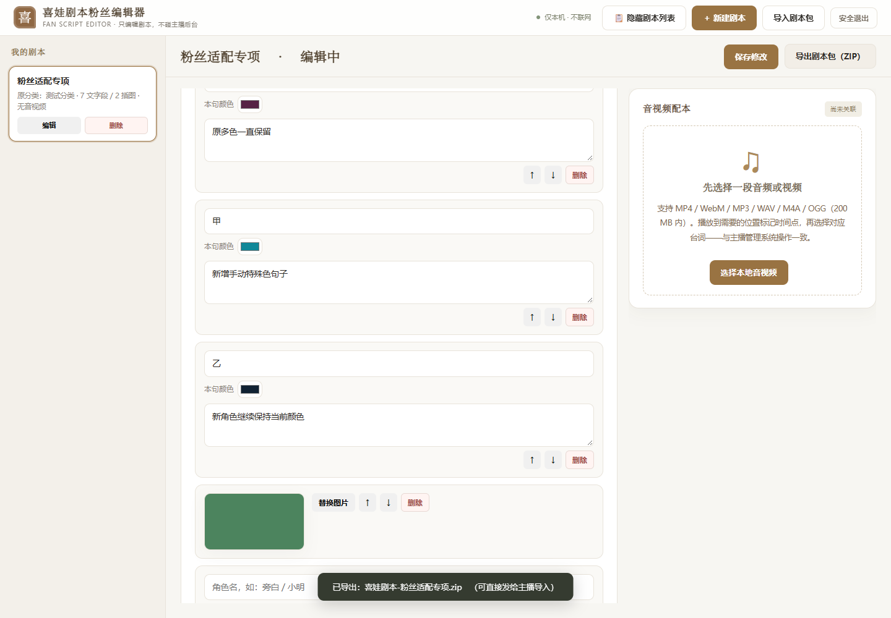
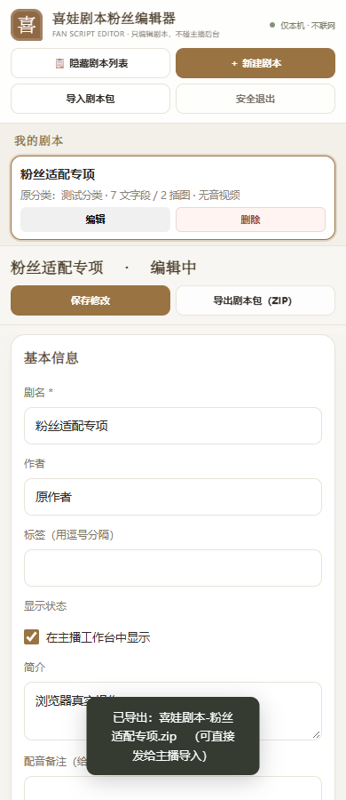
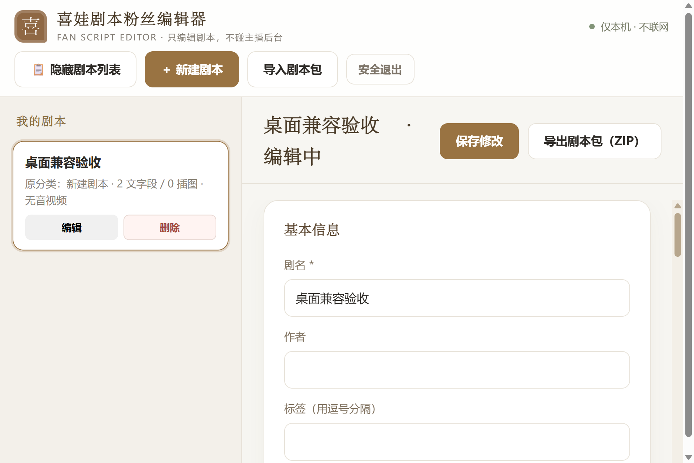
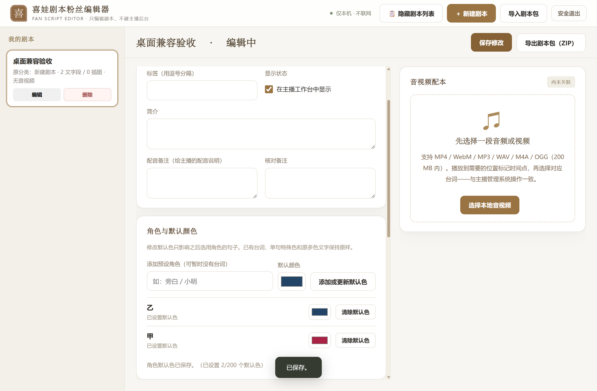
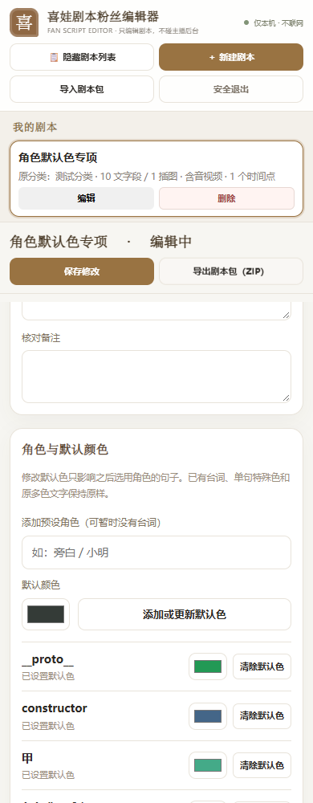

# 粉丝编辑器适配与交付

更新日期：2026-09-30。结论：**当前粉丝编辑器0.2.1源码已适配当前主播管理系统的单篇剧本交换，可以交给构建者重新打包EXE。** 本轮没有重新构建EXE，也没有推送GitHub；旧EXE不代表本轮源码。

## 用户怎样理解“适配”

主播导出单篇ZIP → 粉丝打开并编辑 → 粉丝导出ZIP → 主播检查并导入，这条流程已验证。正文、角色默认色、单句特殊色、原始多色文字、插图、音视频和暂停时间点能在两边传递。相同内容自动跳过；同名内容有改动时，由主播选择跳过或明确覆盖，覆盖前保留旧版本。

粉丝工具保留简化操作：新建、正文编辑、插图、音视频配本及单篇ZIP。主播端新加入的自动草稿恢复、80步撤销/重做、已保存历史恢复和双向排版预览仍只在主播端；粉丝端也没有分类管理、直播控制或全库备份合并。因此“交换兼容”不等于两边全部界面功能相同。粉丝完成修改后仍应点击“保存修改”。

后续补漏：粉丝编辑页面在“基本信息”和“正文段落”之间增加“角色与默认颜色”。可先添加还没有台词的预设角色，也可修改或清除默认色；新增句子选用该角色时继承。改变默认色不改旧句、单句特殊色或多色文字；清除后回到正文首色，没有可用首色则保留本句当前色。设置后点击“保存修改”，才在重开和导出ZIP时保留。

## 本轮发现与修复

| 问题 | 当前处理 |
|---|---|
| 新版ZIP含`role_colors`，旧粉丝校验器会拒绝 | 接受并校验角色默认色，旧包缺字段兼容为空字典；新建、保存和导出保留该字段 |
| 新增、排序、删除或插图重绘会丢失未保存输入 | 输入先写回当前正文模型；结构操作保留草稿；保存返回后同步最新模型 |
| 已有角色无候选、句子改色还被旧`runs`覆盖 | 同本角色候选及默认色继承；单句手动色可保留；改文字/句色清理失效片段，未改原文保留多色与来源 |
| 上次只兼容了默认色数据与继承，漏了粉丝设置入口 | 补“角色与默认颜色”面板，可新增预设、修改或清除默认色；仅影响之后选用角色，已有句子不批量改 |
| 图片上传延迟后可能写入另一剧本或排序后的错误段 | 按工作区和稳定段落ID核对回包 |
| 窄屏媒体区遮住正文 | 上下布局按自然高度排列，正文与媒体在内容区滚动，保存/导出留在顶部 |
| 桌面壳要求健康接口返回工作区路径，旧API缺字段 | 返回实际绝对`data_dir`，目录身份校验及服务退出监控正常 |
| 项目便携Python不自动把脚本目录加入搜索路径 | 开发入口明确加载粉丝工具自己的模块 |
| 新EXE可能继续复用旧释放的`main.cjs` | 比较并更新桌面入口与版本文件；运行时缺关键文件或版本变化时补齐，不删除粉丝工作区 |
| 打包配方写死本机路径 | 按`.spec`位置解析工程及运行时目录，可从另一个完整检出目录构建 |
| 旧桌面验收把其他Electron窗口计入结果 | 只识别本测试目录所属进程及其子进程，不关闭其他应用 |

## 实际验收范围

| 检查 | 本轮结果 |
|---|---|
| 粉丝后端字段、原文、时间点和健康接口 | 9项通过 |
| 最新主播真实API → 独立粉丝服务 → 最新主播API | 5项通过；含当前16篇资料只读副本逐篇往返、资源字节核对、查重跳过和明确覆盖 |
| 真实Edge粉丝编辑流程 | 7组通过，零页面错误；1440/960/390px截图已目视检查 |
| 新增角色默认色设置面板专项 | 10组通过：新增/修改/清除、旧句/runs保留、名称及200项上限、保存锁、重开/真实ZIP验证、正常/390px、解除媒体时草稿保留 |
| 真正Electron粉丝窗口 | 补面板后7组通过：工作区身份、新增预设未直接写入/改旧句、正式保存默认色、1280×840、125%缩放、960×640的125%缩放，以及安全退出后的服务/窗口联动 |
| 源码入口自启动桌面与关停 | 通过；仅核对本测试所属Electron，服务记录正常清除 |
| 桌面组件缓存升级 | 3项通过：旧壳更新、缺失/变版本运行时补齐、不完整冻结资源拒绝；粉丝资料保留 |
| 旧导入及新建流程回归 | 两个源码流程通过；使用粉丝本地包校验，不替代上面的真实主播互通检查 |
| 新EXE本体 | **待构建者打包后实测**，不能用上述源码结果替代 |

所有写入使用隔离测试资料，未初始化、恢复或改写日常16篇资料库。主播正在展示的快照、队列及旧资料未被交换检查改动。主系统此前137项后端验收属于前一批次，本轮不重复宣称跑过该全套。

当前16篇副本还包括新版PPT增加的两篇；初始`data/seed.json`仍是首次14篇。GitHub源码不会包含日常`instance/`资料库，构建者不得为补数量覆盖用户现有库。

证据保存在本地`.qa/`，不上传GitHub：

- `fan-compatibility-backend-20260930.json`
- `fan-compatibility-1c38f3dc9e/result.json`
- `browser/fan-editor-result.json`及对应正常/窄屏截图
- `fan-compatibility-desktop-20260930/result.json`及原生窗口截图
- `fan-role-defaults-desktop-20260930/result.json`及新增面板原生截图
- `fan-role-defaults-20260930/browser-result.json`、`final-check.json`及新增面板正常/窄屏截图
- `fan-desktop-smoke-source-20260930.json`
- `fan-legacy-source-20260930.json`
- `fan-compatibility-final-20260930.json`（语法、文档链接、生产保护及测试端口复核）



窄屏时正文与音视频按上下排列，顶部保存、导出仍可使用；以下分别为390px网页检查与960×640窗口在125%缩放下的真实桌面渲染。





补齐后的角色默认色设置面板（实际桌面截图）：





## 豆包打包与GitHub更新提示词

以下整段可以复制给具备本机文件、命令行和GitHub权限的豆包/agent：

```text
请接手“喜娃微PIA工作台”的本次交付，按下列已完成源码打包粉丝工具EXE，并更新现有GitHub仓库。

工程根目录：C:\Users\Lu\Documents\ChatGPT\选本网页
粉丝工具目录：工程内“喜娃剧本粉丝编辑器”
Git远程：https://github.com/shehuilaoliumang/xiwa-pia-workbench.git
当前粉丝源码/桌面组件版本：0.2.1，交换格式 xiwa-script-package v1。

先确认你实际能访问这些文件和已有仓库。若环境没有挂载该目录，不要声称已经构建；请明确缺失访问能力。先读PROJECT_CONTEXT.md、docs/粉丝编辑器适配与交付.md、粉丝README和最新实施与验收记录。

本次打包对象是粉丝编辑器单文件EXE；更新GitHub时同步经核对的主项目和粉丝源码、文档、测试。不要重新生成整个项目ZIP，也不要顺手重做主播工作台EXE。已有旧粉丝EXE不含本次修复，不能改名冒充新构建。

保留用户现有instance/、fan-data/、fan-data-*工作区、全部原始PPT和手工修改。不要把种子或测试覆盖日常库，不要初始化正式Store。不要清空整个build目录；里面的.spec和测试.py是源码，只有build/work和build/dist用于构建产物。

构建前核对你实际使用的Python、PyInstaller和依赖，建立独立构建环境；安装根requirements.txt中的锁定应用依赖和你确认适用的PyInstaller。不要假定项目的runtime/python.exe已经安装PyInstaller。核对主项目desktop/runtime为完整的锁定Electron组件，而非只有electron.exe；从源码另行准备组件时按tools/运行环境说明操作，不修改用户现有资料。

从粉丝工具目录使用当前build/喜娃剧本粉丝编辑器.spec构建，例如：
python -m PyInstaller --clean --noconfirm --workpath build/work --distpath build/dist build/喜娃剧本粉丝编辑器.spec

配方已改为相对自身位置定位；应包含fan_entry、fan_app、粉丝独立storage/script_package/import_parser、templates、static、desktop/main.cjs、package.json及完整Electron运行时。不要直接用根目录storage.py/script_package.py覆盖粉丝模块，也不要把粉丝模块覆盖主播模块。不要为减少文件而放宽包验证或时间点引用规则。

将新EXE复制到一个新建隔离验收目录（路径包含中文和空格），在没有旧释放desktop缓存的情况下运行。新EXE应可脱离工程目录和全局Python运行。另在用户资料副本上验证升级复用旧desktop时，桌面入口更新且原工作区保留；绝不拿正式工作区试覆盖。

在工程根目录设置FAN_EXE为该新EXE的绝对路径，执行：
runtime/python.exe -X utf8 tests/fan_exchange_compatibility.py
runtime/python.exe -X utf8 喜娃剧本粉丝编辑器/build/closed_loop_test.py
runtime/python.exe -X utf8 喜娃剧本粉丝编辑器/build/create_flow_test.py
runtime/python.exe -X utf8 喜娃剧本粉丝编辑器/build/desktop_smoke_test.py

其中fan_exchange_compatibility.py才是实际“当前主播API→粉丝EXE→当前主播API”的验证；两个旧流程使用粉丝自己的校验模块，不能单独充当主系统兼容结论。各脚本使用独立目录并拒绝复用占用端口；清理和结束只处理它们启动的服务/窗口。

同时人工查看新EXE：新建/文本识别、“角色与默认颜色”面板新增预设/修改/清除（尚无台词也能预设）、已有角色候选与颜色继承、默认色改变不批量改旧句、单句特殊色、多色原文、未保存词句经新增/排序/插图不丢、保存后继续编辑及重开默认色、音视频加载与时间点、导出ZIP中的role_colors、正常/125%/窄窗；确认正文不被媒体区覆盖，保存/导出可操作。验证安全退出与直接关窗均结束自己的本地服务；不得关闭其他主播窗口。

GitHub更新前读取实际git status/branch/log/remote，检查是否有其他agent的未提交修改并保留；与远端核对后，提交经核对的本次项目源码/文档/测试。不要force push、reset、擅自丢弃改动或更改仓库私有状态。README最上方对喜娃的致谢必须保留：抖音号84984989506，感谢她提供PPT、改进思路与使用反馈。

不提交instance、fan-data（包括dev）、runtime、vendor、.qa、desktop-user-data、build/work、build/dist、EXE、交付ZIP、日志和凭据。主仓库已有PPT证据按现行规则保留。本次只更新Git源码，不自行创建公开Release上传EXE；若用户另行授权附件发布再处理。

推送后比对本地提交与远端SHA，给出仓库/提交链接。若认证或网络失败，报告实际错误，不要声称更新成功。最终交付新EXE路径、文件大小、SHA-256、实际运行/交换/退出验证结果、GitHub提交SHA及仍有限制，并确认自己启动的测试服务都已关闭。
```

PowerShell设置新EXE供测试使用的例子（由构建者替换实际路径）：

```powershell
$env:FAN_EXE = 'C:\实际验收目录\喜娃剧本粉丝编辑器.exe'
.\runtime\python.exe -X utf8 tests/fan_exchange_compatibility.py
Remove-Item Env:FAN_EXE
```

这里的提示词用于交接，不表示本轮已执行其中的构建、迁移或推送动作。
