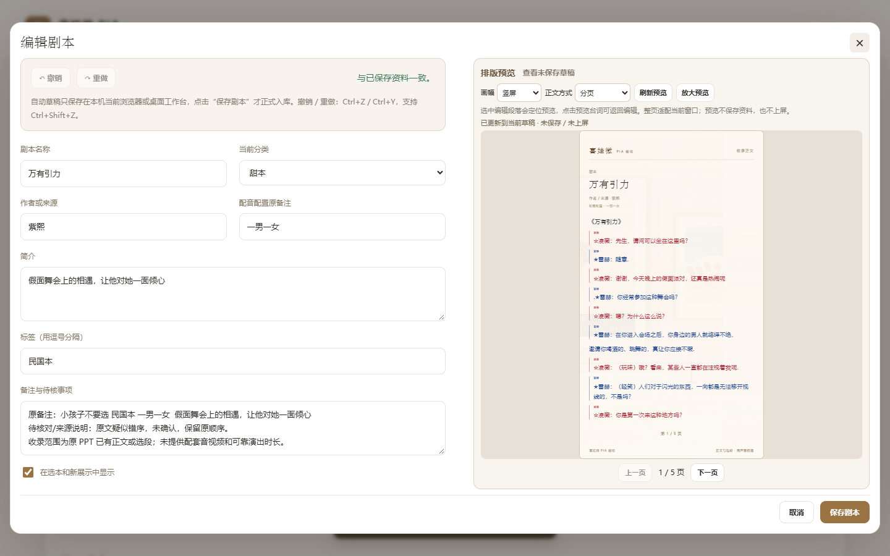
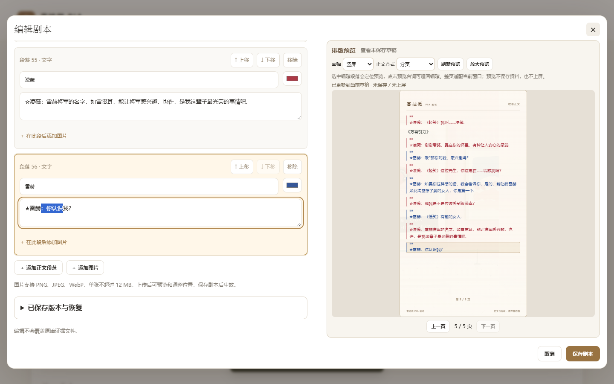
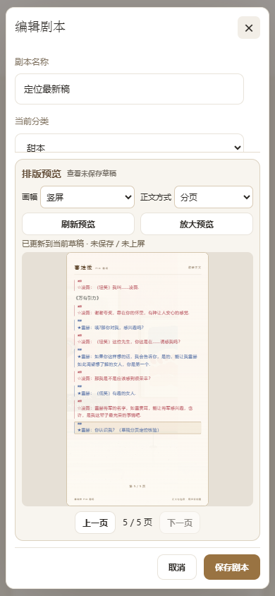
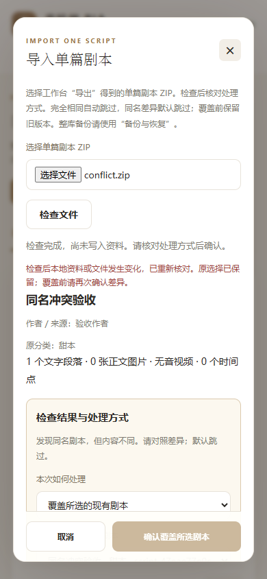
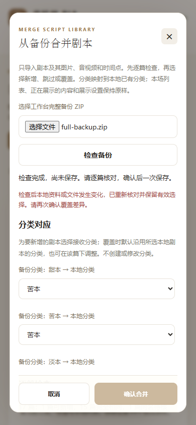

# 编辑、草稿恢复与条目合并

这些功能在“内容管理”中使用。编辑器里显示的是草稿；点击“保存条目”才写入资料库。正在直播的画面会继续使用原先应用的内容，保存后需回展示控制重新应用。

## 设定条目默认配色

1. 新增或编辑条目，展开“编辑正文段落”，再展开“条目配色”。
2. 给已有角色修改默认色，或填写“预设角色”并添加。之后在新句的角色标签中选择这个人物，句子就会采用该颜色。
3. 调整默认色不会自动改掉已有台词。需要一起改时，点击该角色旁的“统一该角色句子”，核对提示后确认；可用“撤销”找回。
4. 某一句需要特殊颜色，直接修改该句旁的颜色。它可以与条目默认色不同。
5. 核对后“保存条目”。

未设置默认色时，沿用正文中该人物的首个有效颜色。同名人物已有不同颜色时，不会自动统一。统一操作会替换该人物各句的原多色片段，请先核对。标签不会自动删掉台词文字中的人物名前缀。

## 未保存草稿与撤销

修改名称、简介、正文、图片顺序或默认色后，顶部会显示草稿保护状态。草稿自动保存在当前电脑、当前浏览器或桌面工作台的本地存储中。

关闭编辑器或重新打开页面后，进入同一篇条目会出现“恢复草稿 / 丢弃这份草稿”。先作选择再继续编辑。新增条目也有一份可恢复的新本草稿。正式资料已在别处改变时，界面会提醒旧草稿与当前版本不同；恢复先填入编辑器，核对后再保存。

“撤销 / 重做”可找回当前编辑过程中的文字、增删段落、图片排序、默认色等变化；支持 Ctrl+Z、Ctrl+Y 和 Ctrl+Shift+Z。连续输入会合并成一步，最多保留80步，重新打开编辑器会重新开始这份操作记录。

**草稿不是完整资料备份。** 它不进入完整备份 ZIP；换浏览器、切换桌面模式、清除浏览器存储或搬到另一台电脑，不能保证草稿仍在。图片草稿引用上传到当前工作台的文件，不把图片字节保存在浏览器中。看到“草稿未保存成功”时，请及时正式保存。上传图片、保存或恢复正在进行时，编辑与关闭操作暂时锁定，完成后恢复。

## 找回已保存的旧版本

1. 编辑已有条目，展开“已保存版本与恢复”，点“查看 / 刷新版本”。
2. 选择一个版本，查看资料字段和正文的差异。
3. 点击“恢复此已保存版本”，核对确认。

恢复会立即修改正式资料，同时把恢复前的当前版本放进历史；如果当前有未保存草稿，会先保存在本机，恢复后仍可选择找回。恢复包含该版本的正文、默认色和关联音视频设置；若原分组已删除，恢复到“未分组”。素材不完整时会提示失败，不直接产生残缺版本。历史只记录正式保存前的版本，不包含每次键盘输入。

## 边编辑边看实际排版

展开“排版预览”，可以选择“竖屏 / 横屏”和“分页 / 连续滚动”。这里采用当前草稿和已保存的该画幅设置，使用展示页同一套排版与分页逻辑。

修改后会自动更新。左侧编辑区单独滚动，滚到条目末尾时右侧预览仍留在原位。分页画面按可用区域的宽度和高度等比例缩小，完整保留一整页；翻页按钮和底部“取消 / 保存条目”保持可见。

编辑和预览现在双向关联：

1. 点击左侧某段的正文、角色标签或颜色，右侧自动定位到对应页，并标亮同一句。输入时保持当前光标和选中文字，不会跳到预览里。
2. 点击右侧台词，左侧独立滚动到相应段落并聚焦输入框；再次点击正在编辑的同一句，会保留当前光标位置。
3. 修改文字后系统会重新分页，并继续定位当前正在编辑的段落。一个长段跨多页时，当前页已经包含这段，就保留当前页。
4. 用“上一页 / 下一页”检查分页；想看清整页时点“放大预览”，再点“恢复编辑”返回。放大和恢复使用同一份草稿和同一个预览窗口。

下图使用长条目示范：左侧有独立滚动区，右侧显示完整竖屏页，底部可以直接翻页和保存。

点击末尾一句后，右侧自动切到含这句的页面并标亮；不必手动一页页寻找。

窄屏时改为上方编辑、下方预览；编辑区单独滚动，预览页、翻页栏和底部按钮仍放在窗口内。窗口高度较小时整页随可用高度收缩，可用“放大预览”进一步查看。[查看 1280×720 窗口示例](images/editor-import/editor-preview-long-low-height.png)。

预览不会保存资料，也不会应用、暂停或改变正在直播的内容。它用于检查正文与图片；音视频播放和时间点仍到“音视频配本”及展示控制操作。改变预览画幅或阅读方式，也不会覆盖已经保存的展示设置。

## 导入单篇条目时检查重复

在“条目资料”点“导入单篇条目”，选取工作台或内容编辑器导出的单篇 ZIP，点击“检查文件”。按结果处理：

| 检查结果 | 如何处理 |
|---|---|
| 没有同名条目 | 选择接收分组，作为新条目导入 |
| 与同名条目内容相同 | 检查后只有“确认跳过”可选，不重复添加 |
| 同名但内容不同 | 默认跳过；需要更新时选择覆盖目标、接收分组（默认沿用目标的分组），核对差异并勾选覆盖确认 |
| 已有多篇同名条目 | 明确选择要覆盖哪一篇，系统不会代选第一篇 |

比较范围包括名称、作者、简介、配音配置、备注、标签、显示状态、条目默认色、正文与逐句颜色/多色片段、插图字节、音视频及暂停时间点。不同的内部编号、素材路径、来源页码和接收分组不算内容差异。检查本身不写入资料，最后确认才执行所选操作。

窄屏同样可以操作；查看同名候选后，先选择处理方式和明确目标，最后确认。

覆盖会更新该篇的资料、正文和关联媒体，保留覆盖前历史及该篇的内部标识，因此已有本场列表仍能找到它。已上屏画面继续使用原快照。检查后目标又被修改时，系统会阻止覆盖并重新检查，保留仍有效的选择、清除覆盖确认勾选；请再次核对并确认。

## 从完整备份“仅合并条目”

在“备份与恢复”点“仅合并条目”，选完整资料备份 ZIP 并检查。先选择分组对应，再逐篇决定新增、跳过或覆盖；相同内容跳过，同名差异默认跳过。覆盖前确认下方列出的范围。若备份内也有多篇同名新本，同一批只选择一篇新增，其余先跳过；不能让多篇同时覆盖同一个目标。

这项操作只处理条目、条目图片、音视频和时间点。不导入备份里的分组主题、展示设置、本场列表、直播状态或历史记录；也不替换原 PPT。覆盖前会在当前工作台产生一份旧版本历史。整批合并一起成功或一起回滚，避免失败时只写入半批资料。

分组对应和条目检查区可向下滚动，底部保留“取消 / 确认合并”。图中的红字示范了检查后目标变化时必须重新核对的提示。

“完整恢复备份”仍是另一项操作：它替换当前资料、暂停展示，并保存恢复前完整备份。把别人提供的条目加入自己工作台时，使用单篇导入或仅合并；整机迁移才按需使用完整恢复。

本轮更新的是项目文件，没有重新生成整个项目 ZIP。启动中的旧服务需要先停止，再用原启动文件重新启动；保存或保留未完成草稿后重新打开内容管理页。
